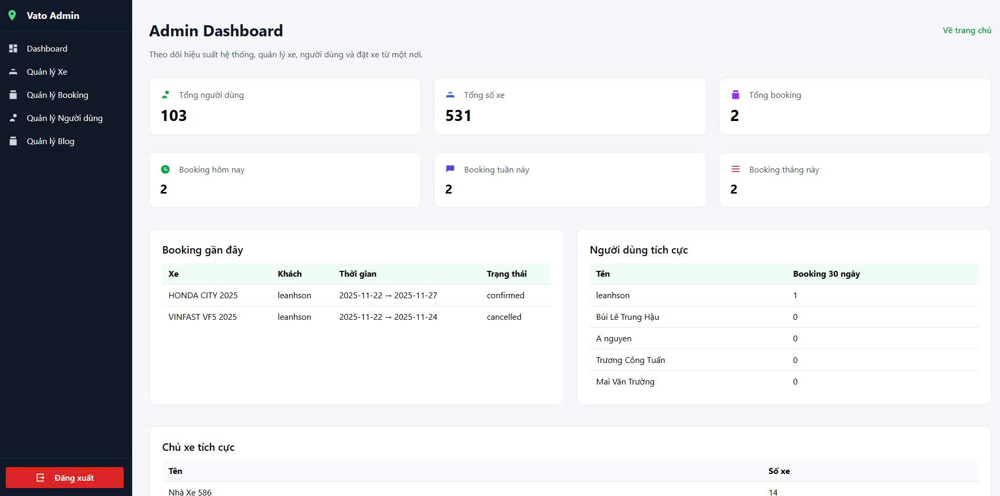
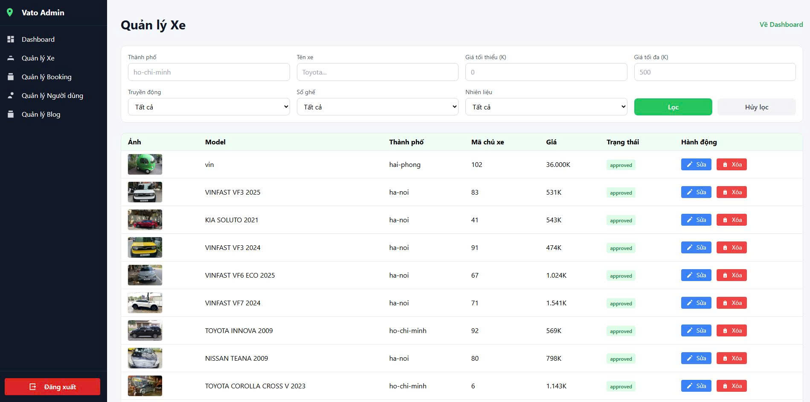
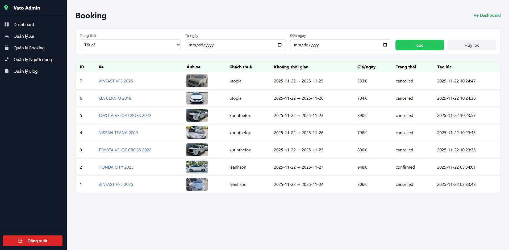
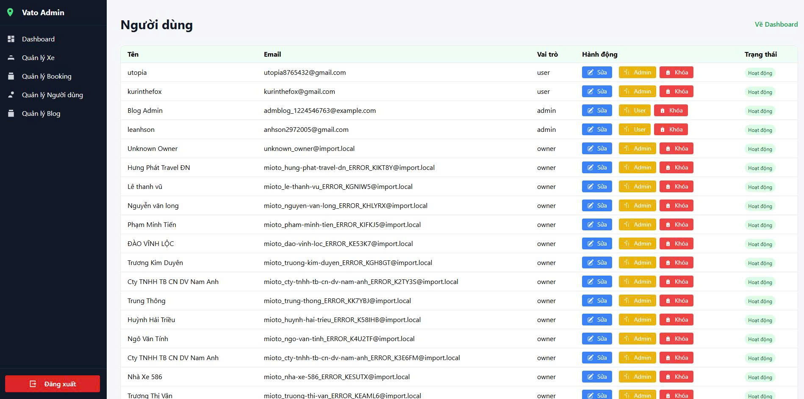
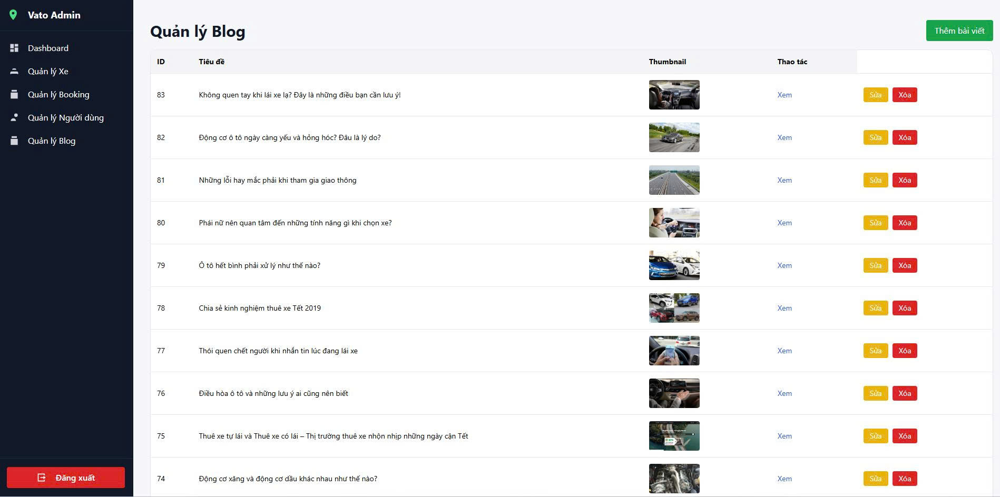
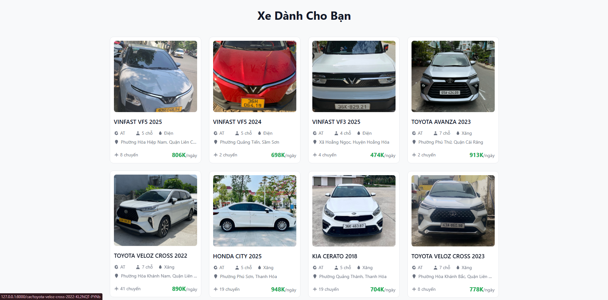
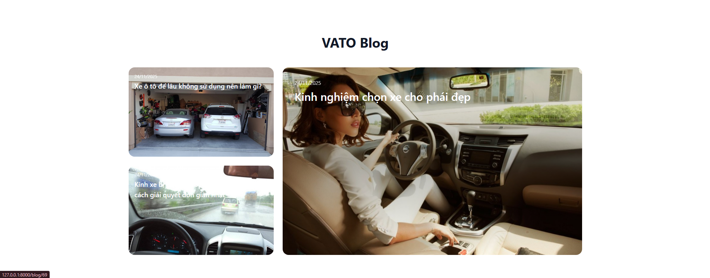
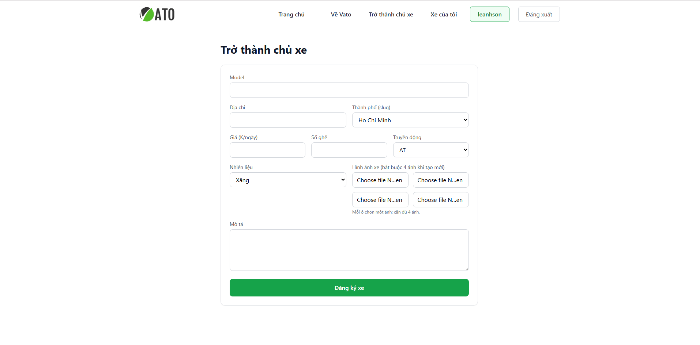
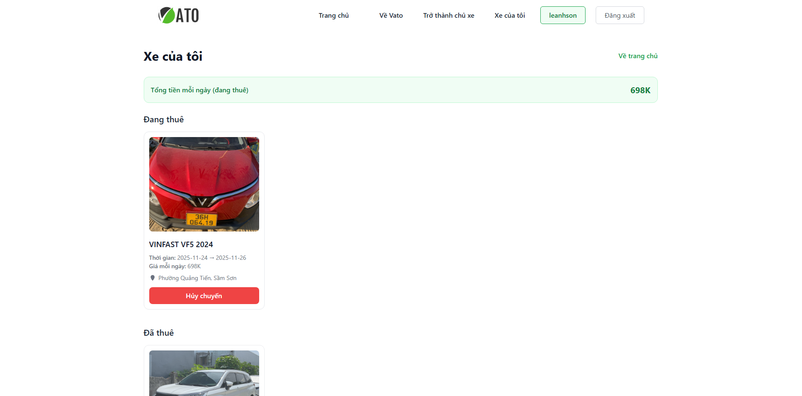

<h2 align="center">
    <a href="https://dainam.edu.vn/vi/khoa-cong-nghe-thong-tin">
    🎓 Faculty of Information Technology (DaiNam University)
    </a>
</h2>
<h2 align="center">
    Youth Union Member Management
</h2>
<div align="center">
    <p align="center">
         
        
        
    </p>

[](https://www.facebook.com/DNUAIoTLab)
[](https://dainam.edu.vn/vi/khoa-cong-nghe-thong-tin)
[](https://dainam.edu.vn)

</div>
 
## 📖 1. Giới thiệu
Hệ thống Quản lý Đoàn viên trong trường Đại học được xây dựng nhằm hỗ trợ công tác quản lý, theo dõi và đánh giá hoạt động của Đoàn Thanh niên trong môi trường giáo dục đại học. Thay vì quản lý thủ công bằng giấy tờ hay các tệp Excel rời rạc, hệ thống mang đến một giải pháp tập trung, hiện đại và dễ sử dụng.

## 🔧 2. Các công nghệ được sử dụng
<div align="center">

### Hệ điều hành

[](https://www.microsoft.com/en-us/windows/)
[](https://ubuntu.com/)

### Công nghệ chính
[](https://www.php.net/)
[](#)
[](#)
[](#)
[](#)
[](https://getbootstrap.com/)

### Web Server & Database
[](https://httpd.apache.org/)
[](https://www.mysql.com/) 
[](https://www.apachefriends.org/)

### Database Management Tools
[](https://dev.mysql.com/downloads/workbench/)
</div>

## 🚀 3. Hình ảnh các chức năng
### Trang admin
### Trang đăng nhập
<p align="center">
    
</p>

### Trang dashboard admin
<p align="center">
    
</p>

### Trang quản lý xe
<p align="center">
    
</p>

### Trang quản lý đặt xe
<p align="center">
    
</p>

### Trang quản lý người dùng
<p align="center">
    
</p>

### Trang quản lý bài viết
<p align="center">
    
</p>

### Trang chính
### Chức năng tìm kiếm
<p align="center">
    
</p>

### Chức năng gợi ý xe
<p align="center">
    
</p>

### Chức năng địa điểm nổi bật
<p align="center">
    
</p>

### Chức năng xem blog
<p align="center">
    
</p>

### Chức năng tràng blog
<p align="center">
    
</p>

### Chức năng cho thuê xe
<p align="center">
    
</p>

### Chức năng xem xe đã thuê
<p align="center">
    
</p>

### Chức năng thuê xe
<p align="center">
    
</p>


### Chức năng xem trang người dùng
<p align="center">
    
</p>


## ⚙️ 4. Cài đặt

### 4.1. Yêu cầu hệ thống
- **PHP**: >= 8.2
- **Composer**: Latest version
- **Node.js**: >= 16.x và npm
- **MySQL**: >= 5.7 hoặc MariaDB >= 10.3
- **XAMPP** (khuyến nghị): https://www.apachefriends.org/download.html

### 4.2. Cài đặt công cụ và extension
- Tải và cài đặt **XAMPP** với PHP 8.2+
- Cài đặt **Composer**: https://getcomposer.org/download/
- Cài đặt **Node.js**: https://nodejs.org/
- Cài đặt **Visual Studio Code** và các extension:
  - PHP Intelephense
  - Laravel Extension Pack
  - MySQL
  - Prettier – Code Formatter

### 4.3. Clone project
Clone project về thư mục `htdocs` của XAMPP:

```bash
cd C:\xampp\htdocs
git clone https://github.com/LEANHSON-1771020591/nhom8-xay-dung-ung-dung-web-quan-ly-dich-vu-thue-xe-tu-lai.git BTL
cd BTL
```

### 4.4. Cài đặt dependencies

#### Cài đặt PHP dependencies (Composer)
```bash
composer install
```

Nếu chưa có Composer toàn cục, tải `composer.phar`:
```bash
php -r "copy('https://getcomposer.org/installer', 'composer-setup.php');"
php composer-setup.php
php composer.phar install
```

#### Cài đặt Node.js dependencies
```bash
npm install
```
